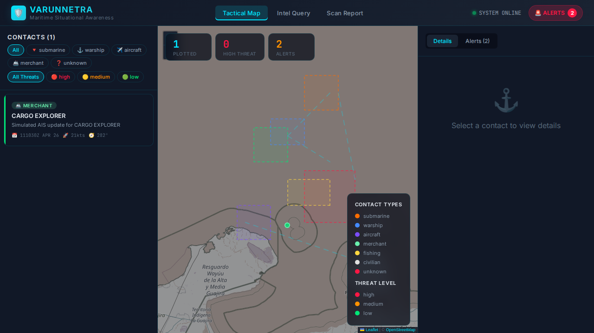
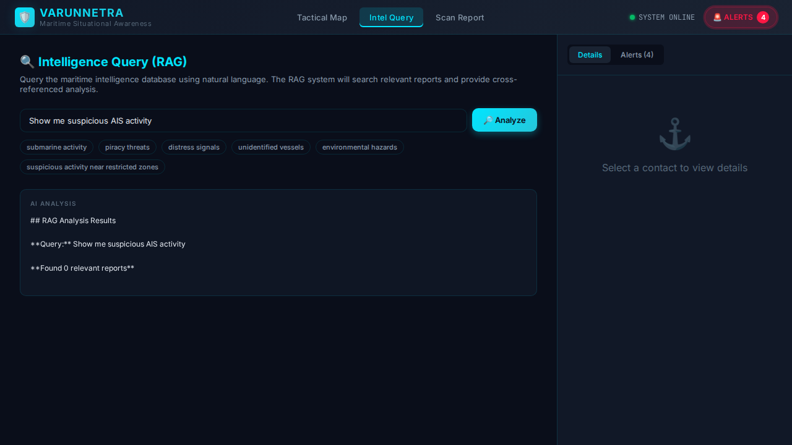

# 🛡️ VarunNetra: Maritime Situational Awareness System

> **Advanced Naval Intelligence Platform** | Real-time Maritime Surveillance | AI-Powered Analysis

[](https://www.python.org/downloads/)
[](https://nodejs.org/)
[](https://react.dev/)
[](https://flask.palletsprojects.com/)
[](https://opensource.org/licenses/MIT)

VarunNetra is a state-of-the-art maritime situational awareness platform designed for naval intelligence and coastal security. By integrating real-time AIS data streaming with Retrieval-Augmented Generation (RAG), VarunNetra provides commanders with an unprecedented tactical edge in identifying, tracking, and analyzing maritime threats across the globe.

## 🎯 Key Capabilities

- **Real-time AIS Integration**: Live vessel tracking powered by `aisstream.io` WebSocket data.
- **Intelligent Tactical Map**: Interactive Leaflet-based map with marker clustering for high-density vessel environments.
- **Automated Threat Detection**: AI-driven behavioral analysis for speeding, unauthorized zone entry, and suspicious activity.
- **Advanced RAG Analytics**: Natural language intelligence queries with strict security guardrails to prevent hallucinations and maintain operational focus.
- **Decluttered Tactical UI**: Modern, high-readability dashboard with collapsible panels to maximize situational awareness.
- **Multi-Source Intelligence**: Seamlessly ingest AIS data, manual communication reports, and document scans (OCR).

## 📸 Tactical Interface

<p align="center">
  
  <br>
  <em>Tactical Map View with clustered vessel markers and real-time status panels.</em>
</p>

<p align="center">
  
  <br>
  <em>Intelligence Query (RAG) providing AI-powered analysis of maritime reports.</em>
</p>

---

## 🏗️ Architecture

The system follows a modern full-stack architecture designed for real-time responsiveness and security.

```text
VarunNetra/
├── Backend/                    # Flask Intelligence Server
│   ├── app.py                 # REST API + Socket.IO + Security (Talisman)
│   ├── ais_service.py         # Real-time AIS WebSocket Client (aisstream.io)
│   ├── rag_engine.py          # RAG Engine with Google Gemini & FAISS
│   ├── alert_engine.py        # Automated behavioral threat detection
│   ├── data_parser.py         # Structured maritime data extraction
│   └── requirements.txt       # Core dependencies
│
├── Frontend/                   # React + Vite Tactical Dashboard
│   ├── src/
│   │   ├── App.jsx            # Dynamic Dashboard with Collapsible Panels
│   │   └── index.css          # Navy Tactical Design System
│   └── vite.config.js         # Optimized Vite build
│
└── README.md                  # Comprehensive Documentation
```

## ✨ Featured Enhancements

### 🚢 Real-time AIS Tracking
The system now connects directly to the global AIS stream.
- **Live Updates**: Instantaneous position reports for thousands of vessels.
- **Simulation Fallback**: Built-in simulator for development and testing when live API keys are unavailable.
- **Data Enrichment**: Automatic classification of vessel types (Warship, Merchant, Submarine, etc.).

### 🛡️ Enhanced Security & Guardrails
- **LLM Guardrails**: The RAG engine is restricted to maritime intelligence, preventing off-topic discussions and ensuring concise military-style responses.
- **System Security**: Integrated `Flask-Talisman` for robust Content Security Policy (CSP) headers.
- **Input Validation**: Sanitized query processing to protect intelligence data.

### 🗺️ Next-Gen Tactical Map
- **Marker Clustering**: Automatically groups vessels in busy ports to maintain UI clarity.
- **Collapsible Panes**: Maximize map area by hiding sidebar contacts or detail panels with a single click.
- **Behavioral Alerts**: Visual indicators for vessels violating speed limits or restricted maritime zones.

---

## 🚀 Getting Started

### 1. Backend Deployment

```bash
cd Backend
pip install -r requirements.txt

# Configure your environment
echo "GEMINI_API_KEY=your_gemini_key" >> .env
echo "AIS_STREAM_API_KEY=your_ais_key" >> .env

python app.py
```
*Backend runs on `http://localhost:5000`*

### 2. Frontend Launch

```bash
cd Frontend
npm install --legacy-peer-deps
npm run dev
```
*Frontend runs on `http://localhost:3000`*

---

## 📊 Automated Alert System

| Alert Type | Description | Severity |
|------------|-------------|----------|
| `HIGH_THREAT` | Identified hostile entities or high-risk communications | Critical |
| `ZONE_VIOLATION` | Unauthorized vessels in Military or Environmental zones | Warning |
| `SPEEDING` | Vessels exceeding safe operational limits in port approach lanes | Warning |
| `SUSPICIOUS_AIS` | Detection of spoofed or anomalous AIS transmissions | Warning |
| `DISTRESS` | Automated detection of MAYDAY or emergency broadcasts | Critical |

---

<p align="center">
  Built for Maritime Security Professionals. 🛡️
</p>
